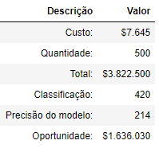

# Funcionários com a probabilidade de ficar ou de sair da empresa
Este repositório contém script para classificar funcionários com a probabilidade de ficar ou sair da empresa.

 

# _Objetivo do projeto_

Usar Machine Learning para classificar quais funcionários tem uma tendência de ficar ou sair do emprego.

 

# _1. Problema de Negócio_

Contratar e reter funcionários são tarefas extremamente complexas que exigem capital, tempo e habilidades.

A contratação de um novo funcionário custa em média $7645 (em uma empresa com aproximadamente 500 funcionários) e demora mais ou menos 52 dias para um funcionário ocupar de fato sua nova posição.

Foi entendido que o problema apresentado pelo time de negócios é a dificuldade em manter funcionários na empresa, para isso, foi solicitado um projeto para a previsão de funcionários com tendências de para sair do emprego.

Fonte: https://toggl.com/blog/cost-of-hiring-an-employee

Neste cenário fictício, nossa fonte de dados é um arquivo csv do Kaggle [clicando aqui](https://toggl.com/blog/cost-of-hiring-an-employee).

 

# _2. Justificativa_

- **Por quê:** Dificuldade em manter as pessoas talentosas na empresa.
- **Como:** Com a método CRISP-DM.
- **O quê:** Um modelo Machine Learning para classificar as tendências dos funcionários em relação ao ficar ou sair da empresa.

 

# _3. Premissas_

As variáveis originais do conjuto de dados são: 

Variável | Definição
------------ | -------------
Age | idade das pessoas|
Attrition | variável resposta|
BusinessTravel | indica se a pessoa faz viajem na empresa|
DailyRate | cálculo do sálario da pessoa|
Department | departamento onde a pessoa trabalha|
DistanceFromHome | distância da casa para empresa em Km|
Education | indica o grau de escolaridade|
EducationField | indica a área da pessoa de atuação na empresa|
EmployeeCount | é como se fosse a contagem dos funcionários|
EmployeeNumber | número dos funcionários, como se fosse o registro do funcionário|
EnvironmentSatisfaction | nível de satisfação do funcionário com o ambiente de trabalho|
Gender | gênero|
HourlyRate | indica o número de horas trabalhadas|
JobInvolvement | envolvimento no trabalho|
JobLevel | nível de trabalho|
JobRole | nome das profisões|
JobSatisfaction | satisfação no trabalho|
MaritalStatus | estado civil|
MonthlyIncome | renda mensal|
MonthlyRate | taxa mensal|
NumCompaniesWorked | número de empresas que o fúnionario trabalhou|
Over18 | indica se o funcionário tem mais de 18 anos|
OverTime | indica se o funcionário faz horas extras|
PercentSalaryHike | indica o percentual de aumento que o funcionário ganhou|
PerformanceRating |avaliação de desempenho do funcionário|
RelationshipSatisfaction | indica o nível de satisfação|
StandardHours | quantas horas o funcionário trabalha|
StockOptionLevel | indica se a empresa tem ações na bolsa de valores|
TotalWorkingYears | indica quanto tempo o funcionário está trabalhando na empresa|
TrainingTimesLastYear | tempo em treinamento|
WorkLifeBalance | equilíbrio entre vida profissional|
YearsAtCompany | quantos anos o fucionário trabalhou na empresa|
YearsInCurrentRole | quantos anos de atuação na função atual|
YearsSinceLastPromotion | anos desde a última promoção|
YearsWithCurrManage | quantos anos está trabalhando como gerente|

 

# _4. Planejamento da Solução_

Este projeto foi separado em duas partes:
1. Um arquivo para fazer Análise exploratória dos dados, com objetivo de analisar os dados para gerar insights.
2. O segundo arquivo tem a ênfase na construção de um modelo para fazer a classificação dos funcionários.

Toda a solução foi baseada no método CRISP-DM (Cross Industry Standard Process for Data Mining).

 

 

# _5. Insights_

*Resumo dos insights durante análise exploratória de dados (EDA):*

**1º Gráfico:**

 

**Nota:**
- Temos uma proporção de 20% de funcionários com chance em sair da empresa.
- E os dados estão desbalanceados que para aprendizado do modelo, vamos ter que fazer o balanceamento.

**2º Gráfico:**

 

**Nota:**
- Pessoas entre 34 há 36 anos é grupo onde a maioria ficam na empresa e uma pequena parcela das pessoas sai.
- Pessoas entre 18 há 20 anos supera a quantidade de pessoas que não tem chance em sair da empresa.

**3º Gráfico:**

 

**Nota:**
- Podemos observar que conforme a idade vai aumentando a tendência das pessoas é que fiquem na empresa.
- A partir da idade de 31 anos segue uma tendência de queda das pessoas que tem chance em sair da empresa.
- Podemos informar para o RH a fazer uma entrevista com os funcionários que tem uma idade menor de 32 anos.

**4º Gráfico:**

 

**Nota:**

O gráfico mostra a distribuição de probabilidade da variável.
- A maioria das pessoas que sairam da empresa, elas moram entre 1 a 10 km de casa até o trabalho.
- A densidade das pessoas que ficam na empresa está entre 1 á 3 km e proporção de pessoas moram maior que 10 km é menor que a proporção das pessoas que sairam.

**5º Gráfico:**

 

**Nota:**

- As pessoas que tem chance em sair da empresa são solteiras (o) que em relação ao total de pessoas que tem a chance em sair da empresa corresponde a 50%.

 

# _6. Modelos de Machine Learning_

_**Foi usado dois algoritmos para construir o modelo de classificação:**_

1. Regressão logística.
2. Random forest.

_**Comparação dos modelos de machine Learning:**_

 

**Nota:**

- O modelo **Random Forest - HP**, mostra que teve um Overfitting, ou seja, o algoritmo não consegue apreender um comportamento, não é capaz de generalizar que é a capacidade de acertar os dados que ele nunca viu.
- O modelo **Regressão Logistica - HP**	mostrou uma capacidade de generalização.

**Um ponto importante:** Estamos trabalhando com um Conjunto de Dados Pequeno, porque quanto mais dados significa que mais informações estou passando para o algoritmo treinar.

_**Modelo final:**_

 

**Nota:**

- Como o contexto de negócio é classificar **a probabilidade de ficar na empresa ou de sair**, então vamos escolher o algoritmo de **Regressão Logistica**, porque toda vez que fazer uma classificação utilizando esta base de dados, nós temos **84%** de chance em acertar está classificação.

 

# _7. Performance do Modelo de Machine Learning_

- Contratar e reter funcionários são tarefas extremamente complexas que exigem capital, tempo e habilidades e a contratação de um novo funcionário custa em média **$7.645**, segundo a fonte mencionada no contexto de negócio.

- Então usando o modelo de classificação podemos identificar cerca de **84%** de chance em acertar está classificação, mas com uma precisão de **51%** surgindo uma oportunidade para o departamento de RH reduzir um desperdício de contratação.

 

 

# _8. Conclusão_

E o resultado desta solução, caso fosse implementada e aplicando o modelo podemos identificar sobre os 500 funcionários, 214 colaboradores com chance em sair da empresa, surgindo uma oportunidade para o RH em reduzir um desperdício de contratação de $1.636.030.

 

# _9. Próximos passos_

- Coletar mais informações para que o algoritmo possa aprender um comportamento das pessoas que tem a probabilidade em sair da empresa.

- Gerar novas features (Características), para alcançar um equilibrio e para manter o algoritmo complexo suficiente para ele entedener o comportamento, mas não tão complexo ao ponto dele decorar.
